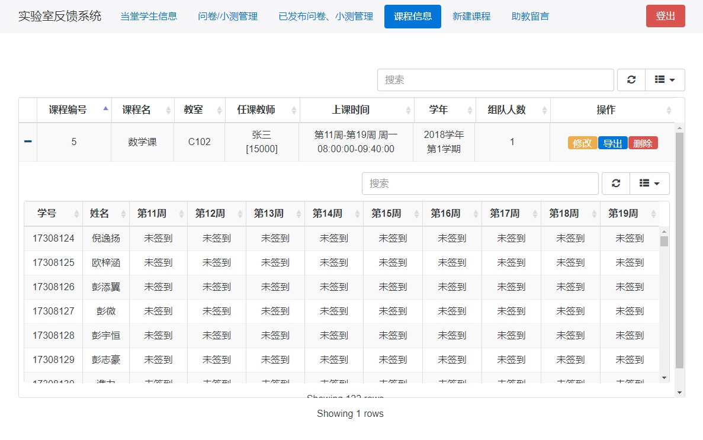

# 教学教师使用手册
---

## 1、适用对象

本手册适用于上课老师。

## 2、使用方法

#### 访问方法
1. 服务器本地登陆
    在管理员开启服务器环境之后，直接在服务器上开启谷歌浏览器访问本地域名`lab.local/admin`
2. 局域网环境登陆
    在管理员开启服务器环境之后，在局域网内的机器上开启谷歌浏览器输入服务器的ip地址`172.18.204.250` [实际可能有误差，请自行查看服务器局域网内的ip地址] 
    
#### 功能介绍
###### 注册
- 注册，进入管理登陆界面后进行注册操作
  

- 填写相关信息，选择身份即可
  

###### 登陆
- 注册成功之后回到登陆页面选择自己对应身份[教学老师登陆]
  

###### 课程导入
- 课程信息建立与学生信息导入，选择`新建课程`选项卡，填写信息并上传课程的学生信息excel文件
  

- 在导入之前请再三确定课程信息无误，一经提交无法修改学生信息
  

###### 课程查看
- 课程导入成功之后可以在`课程信息`选项卡下查看自己的课程信息
  

- 课程修改，点击表格中对应课程的修改按钮即可
  

- 课程导出，默认导出的路径为项目路径下的output文件夹`C:/xampp/htdocs/LabRecord/output/`
  

###### 签到情况查看
- 在`当堂学生信息选项卡`，可以查看当前时段，当前登陆的教师所属的课程学生签到情况
  

###### 问卷与小测功能
待开发

## 3、注意事项

- `新建课程`时候的学生excel形式应该符合教务处导出形式，大致如下，错误的导入形式可能会导致未知的错误
  