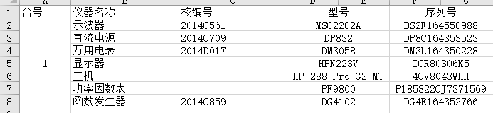
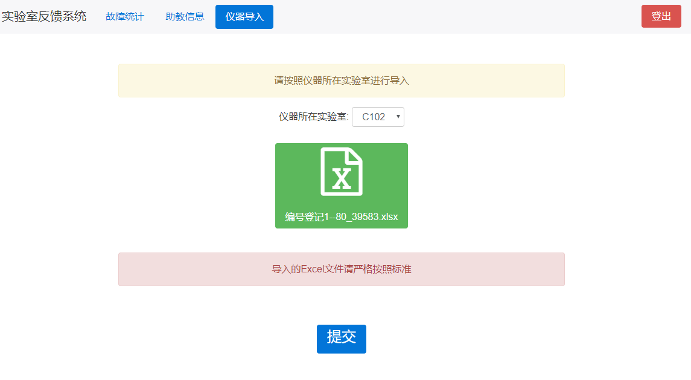
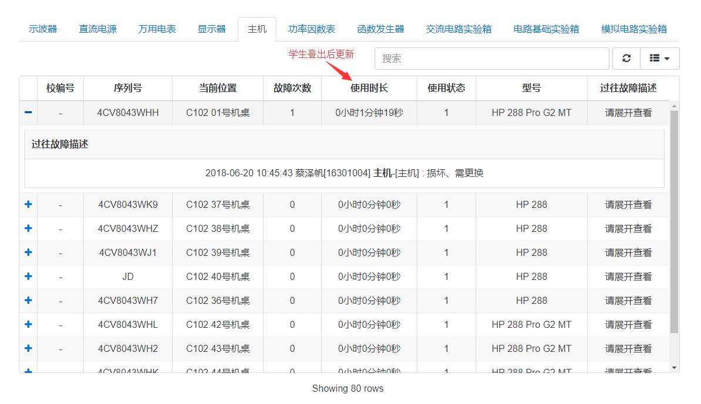
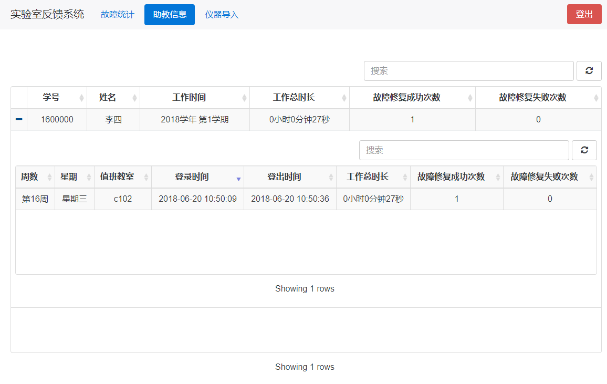

# 仪器管理老师使用手册
---

## 1、适用对象

本手册适用于实验室仪器管理老师。

## 2、适用方法
#### 访问方法
1. 服务器本地登陆
    在管理员开启服务器环境之后，直接在服务器上开启谷歌浏览器访问本地域名`lab.local/admin`
2. 局域网环境登陆
    在管理员开启服务器环境之后，在局域网内的机器上开启谷歌浏览器输入服务器的ip地址`172.18.204.250` [实际可能有误差，请自行查看服务器局域网内的ip地址] 
    
#### 功能介绍
###### 注册
- 注册，进入管理登陆界面后进行注册操作
  

- 填写相关信息，选择身份即可
  

###### 登陆
- 注册成功之后回到登陆页面选择自己对应身份[仪器管理老师登陆]
  

###### 仪器信息导入
- 如果是第一次使用，需要将仪器信息按照标准形式组织，以如图的形式构建仪器序号细节
  

- 在`仪器导入`选项卡中选择要导入的仪器所在教室，导入构建完成的仪器信息，一经提交无法修改
  

###### 查看仪器使用情况
- 在`故障统计`选项卡中可以看到各类仪器的统计情况,不同仪器通过选择不同的选项卡得以查看
  

###### 查看助理信息
- 在`助教信息`选项下可以查看所有助教的登陆详细信息与故障处理次数的统计
  

## 3、注意事项
- Excel仪器信息的导入需要注意按照既定形式构建，避免未知错误