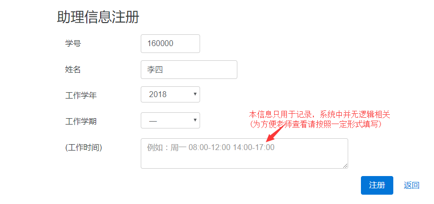

# 助理使用手册
---

## 1、使用对象

本手册适用于实验室助教

## 2、使用方法

#### 访问方法
1. 服务器本地登陆
    在管理员开启服务器环境之后，直接在服务器上开启谷歌浏览器访问本地域名`lab.local/admin`
2. 局域网环境登陆
    在管理员开启服务器环境之后，在局域网内的机器上开启谷歌浏览器输入服务器的ip地址`172.18.204.250` [实际可能有误差，请自行查看服务器局域网内的ip地址] 

#### 功能介绍
###### 注册
- 注册，进入管理登陆界面后进行注册操作
  

- 填写相关信息，选择身份即可
  

###### 登陆
- 注册成功之后回到登陆页面选择自己对应身份[助理登陆]
  

- 登陆后选择助教所在的课室[该部分涉及系统逻辑，请正常填写，否则无法正常辅助签到和故障处理]
  

###### 辅助学生签到
- 在`当堂学生信息`选项中可以查看当前助理登陆的教室的学生签到信息
  

###### 当堂仪器管理
- `故障处理`选项下可以查看当堂课程的学生提交的仪器故障信息并进行处理
  

- 对故障进行处理时候需要记录处理方式[处理未成功之后该项记录依旧能够进行后续处理]
  
  

###### 查看所有仪器情况
- `故障统计`选项下可以查看所有仪器的故障情况信息
  

###### 助教留言
待开发

## 3、注意事项
- 登陆之后请正确填写课室信息形如`c102`，避免无法查看当堂故障与签到的情况
- 关于故障处理，还可以通过在学生端进行处理记录，不必来回跑动，学生界面如下，处理方式是一致的[不过学生无法修改他人的故障情况]
  
  点击处理之后注意需要记得选择处理人员[会列出当堂的所有助理]，可以让学生帮忙点击处理，减少工作量
  
- 请牢记进行登出操作，该操作涉及工作时长的统计记录