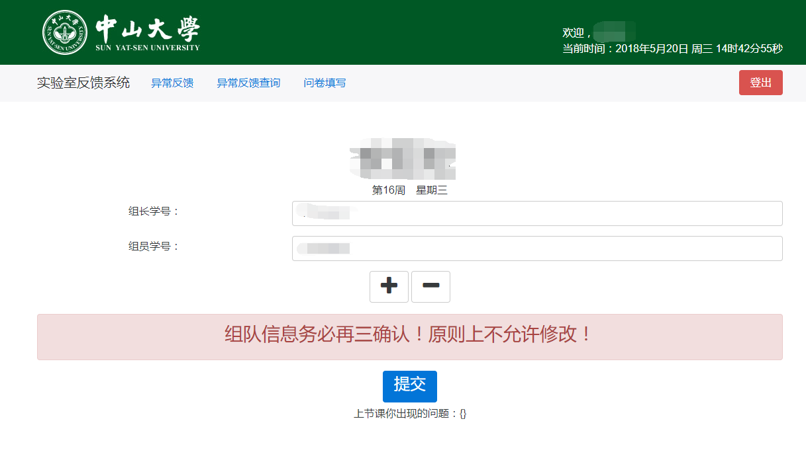
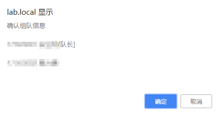
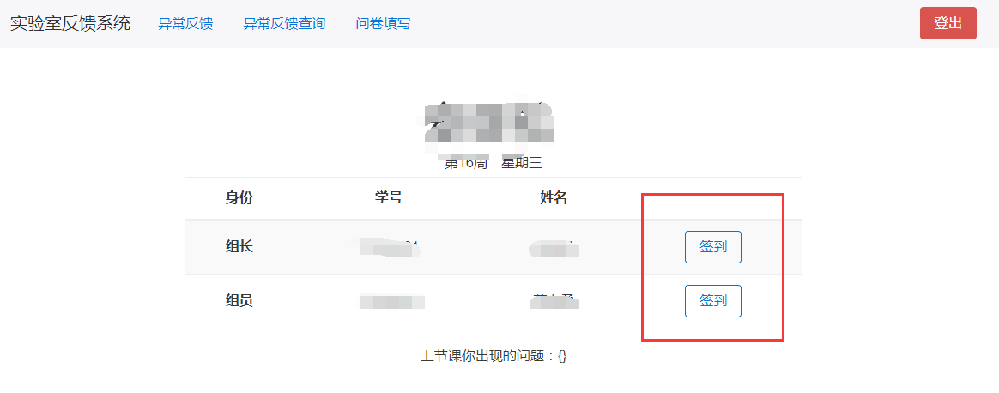
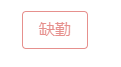
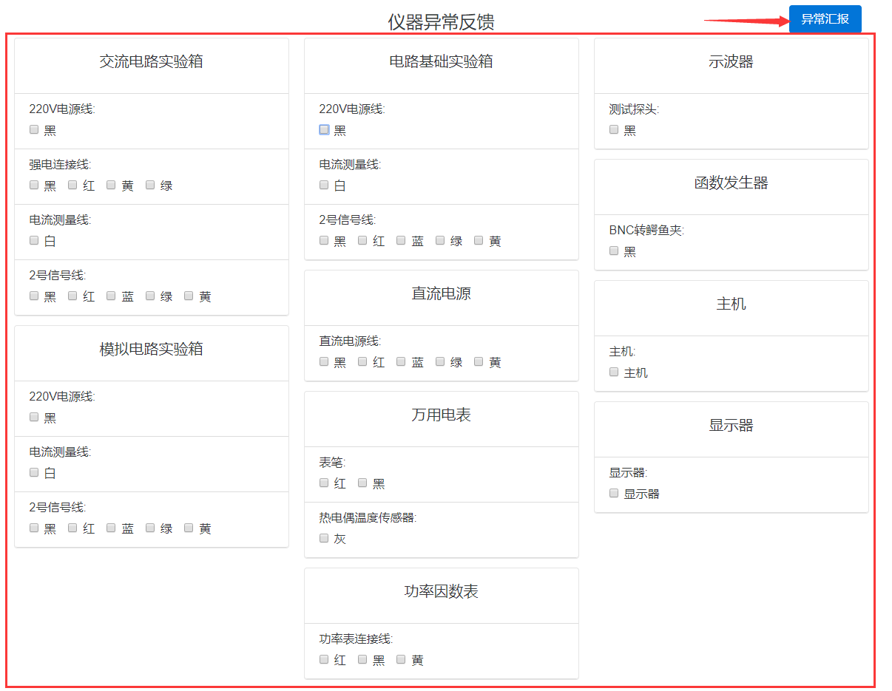
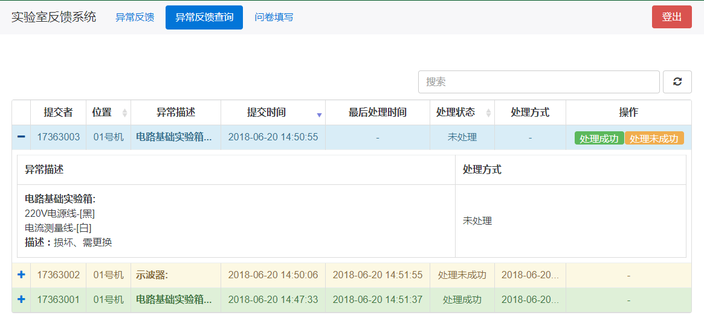
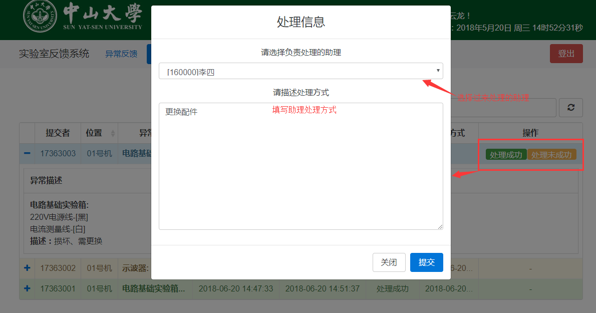

# 学生使用手册
---

## 1、适用对象

本手册适用于上课学生。

## 2、使用方法

###### 登陆
- 打开谷歌浏览器，输入服务器的ip地址`172.18.204.250`即可 [实际可能有误差，具体请询问老师]
  
- 输入学号即可登陆
  如果提示学号不存在
    - 是否正确输入学号
    - 是否在上课时段进行的登陆
    - 是否使用的是教室内的机器进行登陆
    - 使用的机器ip地址是否有改动(会影响正常登陆)

###### 组队(单人课程可跳过这一步)
- 对于多人使用同一桌设备的课程，老师可能会设定组队信息，为了正常完成签到，首次登陆会需要进行组队
  
  注意确认组队信息，一经提交无法修改
  

###### 签到
- 完成组队之后，首页会变成队伍信息，请记得点击右侧按钮进行签到
  
  如果发现签到信息已经缺勤，可以找助理或者老师进行补签操作

###### 仪器故障反馈
- 发现仪器出现故障的时候可以通过`异常反馈`进行故障提交
  
- 提交之后可以在`异常反馈查询`查看当堂课程的异常情况，同时通过查看当前情况表，可以获知助理的处理情况(哪些处理完成了，还有几组能到这里)，需要注意的是表格并没有实时刷新，需要自行点击刷新
  
- 可以协助助理点击处理按钮，但是无法对他人的异常提交进行处理
  

###### 问卷、小测功能
待开发

## 3、注意事项

- 组队信息注意再三确认
- 请牢记进行登出操作，该操作涉及仪器的时长统计与登出的时间登记