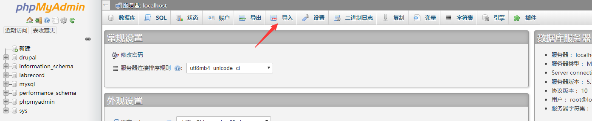

# 系统管理员使用手册
---

## 1、使用对象
本手册适用于对整个系统有所掌握并进行相应配置的人员

## 2、准备工作
##### 项目路径
- 系统的项目路径存放位置为服务器上的`C:/xampp/htdocs/LabRecord`

##### 服务器启动
- 本系统使用的是xampp软件[已安装]辅助搭建的服务器环境，若自行更换服务器环境，相应的项目也要记得移动到新的服务器环境下
- 打开桌面快捷方式`xampp-control.exe`(实际路径为：`C:/xampp/xampp-control.exe`)
  打开apache和mysql服务
  
- 或者通过`xampp-start.exe`开启以上二者服务
  

##### 数据库导入
- 首次开启项目的时候，需要进行数据库数据的导入
  在路径`C:/xampp/phpmyadmin`下自带了数据库管理系统，可以通过访问`http://localhost/phpmyadmin`进入数据库管理系统
  
- 管理员账号 `root`，密码为空，直接登陆 
  
- 选择导入选项，导入项目下的`C:/xampp/htdocs/LabRecord/Describe/Sql`的sql文件
  
  注意首先导入`create.sql`文件，之后再重复操作导入其他`insert-`开头的sql文件
  

## 3、适用方法

##### 登陆
- 本管理员用户只能在服务器上进行登陆，在其他局域网环境下的机器均无法登陆
- 在服务器上打开谷歌浏览器(360浏览器-极速模式)，输入本地域名`lab.local/admin`进入系统登陆界面，输入账户`admin`并直接按下`Enter`键即可进入超级管理员界面 
  

##### 周数设置
- 首次搭建环境/新学期开始，需要对当前周数进行设置 
  

##### 教室信息
- 可以查看所有已注册的教师信息以及其负责的课程内容
  

##### 课程信息
- 与教学老师相似，不同的是可以看到所有老师的课程信息

##### 故障统计
- 与仪器管理老师相关功能一致

##### 仪器导入
- 与仪器管理老师相关功能一致

##### 助教信息
- 与仪器管理老师相关功能一致

##### 问卷、小测功能
待开发

##### 助教留言
待开发

## 4、注意事项
- 周数的设置只需要设置一次，之后会自动更新周数
- 故障统计、助教信息、仪器导入功能均与仪器管理老师功能一致
- 问卷小测、课程信息功能均与教学老师功能一致